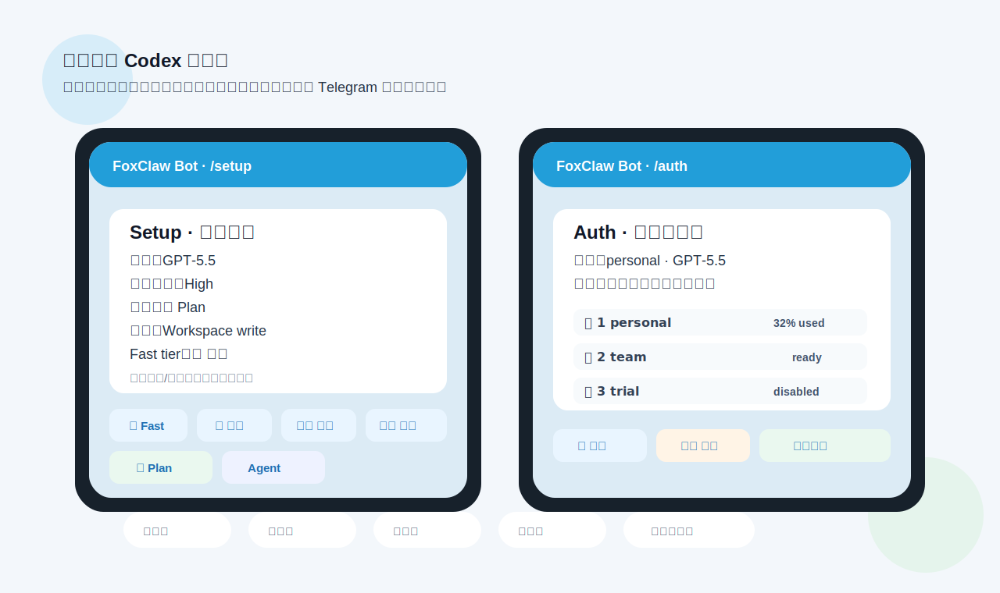

中文 ｜ [English](./README_EN.md)

# 🦊 FoxClaw · 狸爪

**狸爪：一个更适配编程需求的移动端 Codex 控制器。**

FoxClaw（狸爪）的目标很直接：让你用手机控制本机的 Codex，把移动端变成一个真正能用的 web coding 入口。Telegram 或微信负责交互，`codex app-server` 负责本地执行；你发任务、看进度、批审批、切线程，Codex 在电脑上继续写代码。

这适合你离开办公桌去吃饭、在旅途中、在跑步机上，或者陪小孩逛公园的时候继续工作。人可以离开电脑，Codex 不必停；它会把关键进展、错误、审批请求和最终结果同步回手机。

不需要公网服务器。FoxClaw 跑在你自己的电脑上，代码、shell、认证、审批和运行数据都留在本机，只把你允许的操作入口暴露给受信任的聊天账号。

## 为什么是 FoxClaw

**为什么选 Codex 作为底层引擎？**

1. **开源且接口完整** — Codex 是 OpenAI 开源的 CLI agent，并提供 `codex app-server`。FoxClaw 不是模拟终端输入，而是通过更完整的接口读取线程、切换模型、处理审批和恢复会话。
2. **当前编码体验强** — FoxClaw 直接读取你本机 Codex 可用的模型列表；如果你的 Codex 环境已经有 GPT-5.5，就可以在手机端选择和使用它。对高强度编程工作流来说，Codex/GPT-5.5 的体感已经是很多人优先选择它的原因。
3. **多账号额度切换** — 免费额度、Plus/Team 试用、多账号小额度都可以纳入本地 `auth.json_*` 候选。当前账号触发用量限制时，FoxClaw 自动切换下一个可用账号、重启 app-server 并重试刚才的请求。

**适合这些场景：**

- 🍜 离开办公桌去吃饭，Codex 继续编码，有审批需求时手机上点一下
- 🚶 通勤路上、旅途中，不用打开电脑也能下发任务、查看进展、继续调试
- 🏃 在跑步机上、陪小孩逛公园，持续监控 Codex 的编码进程
- 🔒 代码、shell、认证、审批、运行数据全部留在本机，不暴露到公网
- 👤 只允许一个受信任的 Telegram 用户远程操作

## 功能预览



手机端不是简单转发消息，而是给 Codex 的常用工作流做了 Telegram 面板：`/setup` 调模型、推理强度、Fast tier、权限和 Agent/Plan 模式；`/auth` 管理多个 Codex 登录候选，触发限制时自动轮转；`/threads`、`/watch` 和审批按钮用于切线程、观察进度和处理权限请求。

## 从这里开始

- 手头有 Codex、OpenClaw、QwenPaw、Hermes、OpenCode、Kimi CLI 之类能跑 shell 的 agent？推荐走 [Agent 辅助安装](./docs/zh/agent-assisted-install.md)。
- 对 Node、Telegram 机器人、Codex CLI 不太熟？看 [新手安装指南](./docs/zh/install-for-beginners.md)。
- 已经装好，想系统了解 `/help`、`/setup`、`/threads`、`/watch`、`/auth` 和账号轮转？看 [用户手册](./docs/zh/user-manual.md)。
- 想把同一组合法 ChatGPT auth 候选同步到多台机器？看 [跨节点 auth 同步配置指南](./docs/zh/cross-node-auth-sync.md)。
- 想了解每个版本改了什么？看 [更新日志](./CHANGELOG.md)。
- 维护者准备发版？看 [发布 runbook](./docs/zh/release.md)。
- Git、Node、`.env` 都玩得转？直接往下看快速设置。
- 卡住了？看 [故障排查](./docs/zh/troubleshooting.md)。

最低要求：一个或多个 Telegram bot token、你的 Telegram 数字用户 ID、Node.js 24+、一份已登录的 `codex` CLI。首次安装大约 10–20 分钟。新安装请使用 `TG_BOT_TOKENS`；`TG_BOT_TOKEN` 兼容旧的单 runtime 配置，也可在多 bot 模式中标记一个“默认/终端共享”bot。

**30 秒体验**：启动 FoxClaw 后，给你的 Telegram 机器人发一句 `List files in DEFAULT_CWD`。Codex 会在本地检查那个目录，然后把结果发回 Telegram。

## 环境要求

- macOS 或 Linux，`codex` CLI 可用
- Codex 已完成登录认证
- 如果要通过 `/auth add` 或 `/login_device` 从 Telegram 发起设备码登录，需要先在 ChatGPT 左下角用户名菜单进入“设置 > 安全”，启用“为 Codex 启用设备代码授权”
- Node.js 24+
- 一个 `@BotFather` 创建的 Telegram bot token
- 你的 Telegram 数字用户 ID

## 快速设置

```bash
npm install -g @foxden-app/foxclaw
foxclaw init
foxclaw doctor
foxclaw start
```

pnpm 用户：

```bash
pnpm add -g @foxden-app/foxclaw
foxclaw init
foxclaw doctor
foxclaw start
```

`foxclaw init` 会创建 `~/.foxclaw/.env`，并在终端里提示填写 Telegram bot token、Telegram 数字用户 ID 和默认工作目录。如果当前 shell 里有 `HTTP_PROXY`、`HTTPS_PROXY`、`ALL_PROXY` 等代理变量，也会询问是否写入 FoxClaw 配置，避免服务启动后 Codex 走不到同一条网络。任何一项都可以直接回车跳过，之后再用 `$EDITOR ~/.foxclaw/.env` 手动修改。

跑 `doctor` 或 `start` 之前先把 `.env` 填好。私聊模式最小配置：

```dotenv
TG_BOT_TOKENS=123456:telegram-token
TG_ALLOWED_USER_ID=123456789
DEFAULT_CWD=/absolute/path/to/workspace
DEFAULT_APPROVAL_POLICY=on-request
DEFAULT_SANDBOX_MODE=workspace-write
```

配置文件默认在 `~/.foxclaw/.env`。想放别处的话设 `FOXCLAW_ENV=/path/to/.env`。

`foxclaw start` 会自动检查环境并安装/重启后台服务。后续升级直接运行 `foxclaw update`，它会沿用当前的 npm/pnpm 全局安装方式，尝试同步升级 npm/pnpm 安装的 Codex CLI，再完成安装、自检和服务重启，并在聊天回报 FoxClaw 与 Codex CLI 的版本变化。

FoxClaw 只响应 `TG_ALLOWED_USER_ID` 的消息——把机器人拉进群不代表群里所有人都能用。

<details>
<summary>FoxClaw 能做什么</summary>

**核心能力：**
- 通过 Telegram 私聊、群组、话题控制本地 Codex
- 可选微信/iLink 通道；在多 Telegram bot 模式下仍使用原默认 Codex runtime，不与隔离 bot 会话混用
- 手机上完整管理 Codex 线程生命周期：创建、重命名、归档、fork、回滚、compact、review、diff
- 命令、文件变更、细粒度权限审批的内联按钮——手机上一键审批
- MCP elicitation 卡片——工具在 turn 中提出结构化问题时展示

**多账号管理：**
- Codex 账户管理：`/account`、`/quota`、`/login_device`、`/auth add <name>`
- 触发用量限制时自动在本地 `auth.json_*` 之间切换认证
- `/auth` 面板分页查看、筛选、启用、禁用、搜索和切换候选账号；额度按真实窗口展示，多 bot 模式下会按 ChatGPT 额度身份汇总各 runtime 最近掌握的额度快照

**线程与会话：**
- `/threads`、`/open`、`/new`、`/where`、`/interrupt`——稳定的聊天-线程绑定
- 每个聊天独立的设置面板：模型、reasoning effort、Fast tier、access preset、Agent/Plan 模式
- Skills、MCP、hooks、plugins、apps、feature flags、config、requirements、provider diagnostics

**可靠性：**
- SQLite 持久化：绑定、offset、审批、待处理提示、审计日志
- 单实例进程锁，防止同一 bot token 重复 polling
- `TG_BOT_TOKENS` 支持一台机器同时运行多个 Telegram bot；默认每个 bot 使用独立 Codex app-server、会话和 `/auth` 选择
- 如果同时设置 `TG_BOT_TOKEN`，且它的值也出现在 `TG_BOT_TOKENS` 中，匹配的那个 bot 会共享终端默认 `CODEX_HOME` 和 auth，其他 bot 继续隔离

</details>

## 多账号切换

FoxClaw 的一大特色是自动多账号切换。当一个账号触发用量限制时，FoxClaw 会自动切换到下一个可用账号继续工作。

设置方式：

1. 在 Codex 的 auth 目录（通常是 `~/.codex/`）中放置多个认证文件，命名为 `auth.json_personal`、`auth.json_team` 等。
2. 用 `/auth add <name>` 通过 Telegram 直接添加新账号。
3. 用 `/auth` 查看所有候选账号状态。
4. 用 `/auth enable <n>` / `/auth disable <n>` 控制哪些账号参与自动轮换。

通过 `/auth add <name>` 或 `/login_device` 进行设备码登录前，需要在 ChatGPT 网页左下角点用户名，进入“设置 > 安全”，启用“为 Codex 启用设备代码授权”。设备代码等同于一次登录授权，切勿转发给他人或粘贴到不可信页面。

候选较多时，`/auth` 每页显示 8 个账号，并提供翻页、`全部 / 已启用 / 需关注` 筛选。也可以用 `/auth list <关键词>` 搜索文件名，或用 `/auth page <页码>` 直接跳页。文本列表的额度窗口按 Codex 实际返回值展示，例如 `5h:20|7d:25` 或单月窗口 `30d:97`；按钮只显示紧凑的两个剩余数字，例如 `20|25`，未知值显示为 `—`。面板会省略候选名中重复的 `auth.json_` 前缀，磁盘文件名保持不变。

当 Codex 报告用量限制错误时，FoxClaw 会自动：
- 切换到下一个未失败的候选账号
- 重启 app-server 加载新认证
- 用新账号重试刚才失败的请求

## 服务与调试

推荐方式：

```bash
foxclaw start
```

Linux 上会安装/重启用户级 systemd 服务，macOS 上安装/重载 launchd。查看状态：

```bash
systemctl --user status foxclaw.service
journalctl --user -u foxclaw.service -f
```

也可以直接用包装命令：

```bash
foxclaw status
foxclaw restart
foxclaw update
foxclaw stop
```

需要前台调试时：

```bash
foxclaw serve
```

运行时文件默认在 `~/.foxclaw`：

| 用途 | 路径 |
|------|------|
| 数据库 | `~/.foxclaw/data/bridge.sqlite` |
| Bridge 日志 | `~/.foxclaw/logs/service.log` |
| 状态 | `~/.foxclaw/runtime/status.json` |
| App-server 状态 | `~/.foxclaw/runtime/codex-app-server.json` |
| App-server 日志 | `~/.foxclaw/logs/codex-app-server.log` |

可通过 `STORE_PATH`、`LOCK_PATH`、`CODEX_APP_SERVER_STATE_PATH`、`CODEX_APP_SERVER_LOG_PATH` 覆盖。

## 鸣谢

FoxClaw 最初基于 `Gan-Xing/telegram-codex-app-bridge` fork 演进而来，继续以 MIT License 分发。感谢原项目对 Telegram 与 Codex 本地桥接思路的探索。

## Telegram 设置

1. 用 `@BotFather` 创建一个或多个机器人，token 以逗号分隔填入 `TG_BOT_TOKENS`。
2. 拿到你的 Telegram 数字用户 ID，填入 `TG_ALLOWED_USER_ID`。
3. `foxclaw start` 启动。
4. 打开和机器人的私聊，发 `/help`。

可选——群组/话题配置：

```dotenv
TG_ALLOWED_CHAT_ID=-1001234567890
TG_ALLOWED_TOPIC_ID=42
```

- `TG_ALLOWED_CHAT_ID` 留空 → 纯私聊模式。
- 只填 `TG_ALLOWED_CHAT_ID` → 允许一个群组作为默认会话范围。
- 两个都填 → 绑定到某个话题。
- 配了群组后，`TG_ALLOWED_USER_ID` 的私聊依然可用。
- 配置多个 bot 时，同一个授权群内只有 `@botname` 命令、mention 或回复该 bot 的消息会被它处理，避免多个 Codex 会话同时响应。

多 bot 并行示例：

```dotenv
TG_BOT_TOKENS=123456:token_a,234567:token_b
# Optional: mark token_a as the bot sharing terminal/default CODEX_HOME and auth
TG_BOT_TOKEN=123456:token_a
```

FoxClaw 仍然只运行一个系统服务。默认情况下，它会为每个 bot 启动独立 `codex app-server` 和独立 `CODEX_HOME`。因此 A 私聊运行 turn 时，B 私聊仍可独立切换自己的 `/auth`。候选凭据由 FoxClaw 在登录或刷新在线验证后镜像同步；切换或重载前还会从其他 Codex home 恢复同账号较新凭据。各 bot 的当前选择互不影响。每个 bot 首次私聊发送 `/help` 和 `/status`；`/auth` 会标明正在操作的 bot runtime，`/status` 会列出全部 bot 的连接、runtime 类型、当前 auth 和活动 turn 摘要。

多台机器共享同一合法账号池时，可以启用可选跨节点 auth 同步：`AUTH_SYNC_ENABLED=true`、`AUTH_SYNC_KEY` 和 `AUTH_SYNC_PEERS=@peer_contact_bot`。推荐每台机器只选一个联系人 bot；同一节点内的其他 bot 继续走本机 auth 镜像。多 bot 模式下，默认用 `TG_BOT_TOKENS` 的第一个 token 作为联系人 bot。FoxClaw 会通过 Telegram Bot-to-Bot 私聊传输加密 auth 包；本机验证刷新后主动 push，发现本机候选失效时主动 pull peer 已持有的有效副本，并在联系人 bot 私聊里汇总报告发送、接收、排队、导入、失败和人工介入提示。资源富裕、只关心池子数量时，可用 `/config auth_auto_delete on` 或 `AUTH_AUTO_DELETE_NEEDS_REPAIR=true` 让无法恢复的候选自动跨节点剔除，并把通知压缩为池子摘要。`/auth sync events [过滤]` 和 `/auth sync trace <requestId>` 可查看最近通讯流水。跨节点恢复不会自动刷新 token，`/auth refresh all confirm` 会先申请跨节点刷新锁。完整配置、`@BotFather` 操作和验证步骤见 [跨节点 auth 同步配置指南](./docs/zh/cross-node-auth-sync.md)。

如果你需要一路 Telegram 与终端互通 session，把同一个 token 同时填入 `TG_BOT_TOKENS` 和 `TG_BOT_TOKEN`。这个 bot 使用默认 `CODEX_HOME`（未设置时通常是 `~/.codex`）和默认 auth，因此能看到终端 Codex 的本地线程；它不再享有隔离 runtime 的“互不影响”保证，切换 auth 会影响终端和其他默认 runtime。

**怎么找群组和话题 ID：**

1. 先停掉 FoxClaw。
2. 在目标群组/话题里发一条消息。
3. 浏览器打开 `https://api.telegram.org/bot<YOUR_BOT_TOKEN>/getUpdates`。
4. 找 `message.chat.id` → 填 `TG_ALLOWED_CHAT_ID`。
5. 找 `message.message_thread_id` → 填 `TG_ALLOWED_TOPIC_ID`。

> 如果 FoxClaw 还在跑，它可能会先把这条 update 消费掉，所以要先停。

## Telegram 群组检查清单

要让机器人在群组/超级群里收到普通消息：

1. 把机器人加进目标群组。
2. 在 `@BotFather` 里关掉 `privacy mode`。
3. 把机器人设为群管理员。
4. 如果是加群之后才改的隐私模式，把机器人踢出去再重新加。

> 注意：即使 privacy mode 挡住了普通消息，`/status@botname` 这种显式命令可能还是能用的。所以验证群组设置时，请用一条普通文本消息测试。

## Codex App-Server 生命周期

默认配置：

```dotenv
CODEX_APP_AUTOLAUNCH=true
CODEX_APP_LAUNCH_CMD=codex app
CODEX_APP_SERVER_STATE_PATH=
CODEX_APP_SERVER_LOG_PATH=
CODEX_APP_SYNC_ON_OPEN=true
CODEX_APP_SYNC_ON_TURN_COMPLETE=false
```

FoxClaw 会把 `codex app-server` 作为 detached 子进程启动，记录其 pid 和端口。使用 `TG_BOT_TOKENS` 时，默认每个 bot 都有自己的 app-server 与 Codex home，并在该隔离 runtime 内强制使用文件凭据存储；隔离 bot 不自动拉起 Codex Desktop，避免多个新 home 同时初始化桌面状态。用 `TG_BOT_TOKEN` 标记的默认/终端共享 bot 例外：它使用默认 Codex home、默认 auth 和默认 app-server 配置。重启时如果对应进程还活着就直接重连，否则拉起新进程。`/auth_reload` 和认证切换只重启发起操作的 bot runtime。

一般不需要手动固定 app-server 端口。

## 命令

- `/help`
- `/setup` — 统一设置面板
- `/fast <on|off|toggle>`
- `/active <steer|queue>`
- `/status`、`/account`、`/quota`、`/update`
- `/quota_nudge <credits|usage_limit> confirm`
- `/login_device`、`/login_cancel [id]`、`/logout confirm`
- `/auth [list [关键词]|filter <all|enabled|attention>|page <页码>|use <n>|enable <n>|disable <n>|reload|refresh all [confirm]|sync <status|test|push all>|add <name>]`
- `/threads [query]`、`/threads archived`、`/open <n>`
- `/goal [objective|pause|resume|done|budget <tokens|off>|clear confirm]`
- `/history [limit]`、`/files <query>`、`/remote`
- `/new [cwd]`
- `/steer <message>`、`/takeover <message>`、`/queue <message>`
- `/review [base <branch>|commit <sha>|custom <instructions>]`
- `/diff`、`/fork [name]`、`/undo [n]`、`/rollback [n]`
- `/rename <name>`、`/compact`、`/archive`、`/unarchive <n>`
- `/skills [query]`、`/skill <name>`、`/skill_enable <name>`、`/skill_disable <name>`
- `/loaded`、`/hooks`、`/plugins [query]`、`/apps [reload]`、`/features`、`/config`、`/requirements`、`/provider`
- `/mcp`、`/mcp_reload`、`/mcp_login <server>`、`/mcp_resource <server> <uri>`
- `/models`、`/model`、`/effort`、`/permissions`、`/access`、`/mode`、`/plan`、`/agent`
- `/reveal`、`/where`、`/interrupt`

直接发文本会送到当前线程；没有绑定线程时自动创建新线程。

## 微信/iLink

微信支持默认关闭，需要手动开启：

```dotenv
WX_ENABLED=true
WX_ALLOWED_ILINK_USER_IDS=
```

构建完成后跑一次二维码登录：

```bash
foxclaw weixin-login
```

微信运行时文件在 `~/.foxclaw/weixin`。启用 `TG_BOT_TOKENS` 时，微信继续连接默认 Codex runtime 与原 home，不会查看或恢复隔离 Telegram bot 的线程。

## Codex Skill

仓库自带一个 Codex skill。用法看 [FoxClaw Skill 中文说明](./docs/zh/foxclaw-skill.md)。它可以让 Codex 通过 SSH 在本机或远程 Mac 上 bootstrap FoxClaw——写 `.env`、构建、跑 doctor、装 launchd、引导首次消息验证，一条龙。

## 故障排查

`doctor` 报错、Telegram 没回复、服务日志看不懂、重启行为异常——都看 [故障排查](./docs/zh/troubleshooting.md)。

## 运维命令

```bash
foxclaw doctor
foxclaw status
foxclaw start
foxclaw restart
foxclaw update
foxclaw stop
foxclaw uninstall-systemd
```

## 贡献

欢迎到 [GitHub](https://github.com/foxden-app/foxclaw) 提 issue 和 PR。
