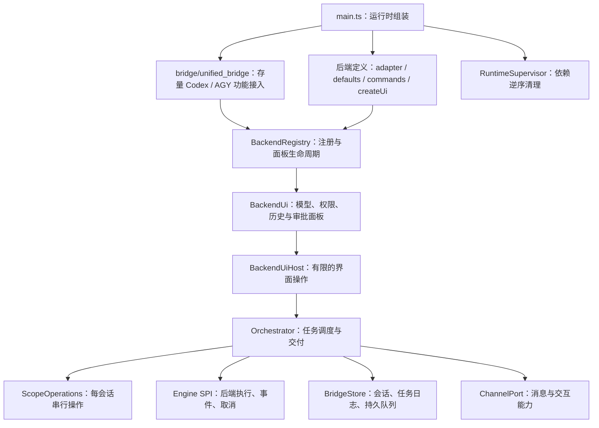

# FoxClaw 架构复审与重构

日期：2026-10-06。基线：v0.12.0。

## 判断

保留后端适配器 + 共享调度的方向，但 v0.12.0 还没有形成完整的后端边界。新增 DSH 时必须同时修改 Antigravity 控制器、调度器、启动逻辑及多处面板分支。问题不是目录名称，而是执行身份、会话状态、界面入口和资源清理由不同地方分别决定。

本轮改动任务调度、通道契约、持久任务日志、资源归属，并提取存量控制器的独立功能。Telegram 为主通道；微信保留文字入口，完整迁移等待观察消息方案落定。存量数据库和导入路径继续兼容。

## 当前边界

- `core/engine_spi.ts` 定义执行契约和后端声明；原生推理档位使用字符串，不受 Codex 枚举限制。
- `core/backend_registry.ts` 保持后端执行身份稳定，允许发现逻辑刷新展示元数据；注册失败不会残留半个后端，清理统一执行且只执行一次。
- `core/backend_ui.ts` 定义面板接口与操作端口。后端面板不再依赖整个调度器实现。全局服务命令优先于后端命令；后端回调归属由注册的界面声明。
- `dsh/backend.ts` 提供一份 DSH 定义，共享 Bot 与独立 Bot 均复用它。统一控制器无需导入或构造 DSH。
- `bridge/unified_bridge.ts` 是存量后端的组合层，不再挂在 Antigravity 引擎目录下。旧导入路径保留为兼容转发。
- `core/access.ts` 是权限策略的领域逻辑，Codex 适配器将当前设置传入原生线程和任务请求。

新增后端应在组装处注入定义。调度器不应再增加 `adapter.id === 某后端` 来处理附件、取消、默认推理档位或菜单。

## 状态约束与修复

### 会话操作

启动、插话、中断、新会话、切换后端和队列领取按 scope 串行执行；不同 scope 独立。任务从启动准备到最终回答交付都保留占用状态，避免两个消息在准备阶段同时启动任务。

所有事件回调验证任务对象的所有权，忽略已取消或被替换任务的会话 ID、增量、错误和终态。取消前先屏蔽旧任务回调，并等待适配器返回的取消承诺完成后释放槽位。取消失败保留占用，不能自动启动重叠任务。Codex / OpenCode 的启动阶段取消也会结束等待者并释放监听器；DSH 无法及时取消时关闭其自有进程。

执行中或仍有排队任务时不能切换后端。未启用的已选后端不会静默退回其他执行器，原会话与设置保留，用户可通过 `/backend` 重新选择。新后端的首次使用清除旧后端权限及模型覆盖；返回时恢复该后端保存的配置。

### 通道收件箱与持久队列

Telegram 更新在分类、准备附件和等待会话锁之前写入持久收件箱。通道只在处理完成后推进收取位置；重启先恢复未完成收件，再接收新更新。处理成功后清除原始载荷，保留收件标识用于去重；原生任务日志另行去重，避免收件重放导致重复执行工具。

新队列载荷记录版本、原始 prompt、后端、工作目录和已落盘附件。已有文本数组格式继续可读。

队列状态为 `queued → processing → completed / failed / cancelled`，只有实际执行和交付结束才进入终态。任务日志为 `accepted → queued / running → delivery_pending → completed / failed / cancelled`，另外记录 `awaiting_confirmation`。普通输入、显式排队和插话在等待会话锁之前保存原始输入、附件引用、模型、权限和后端配置；队列写入与任务关联使用同一数据库事务。队列已领取、任务日志仍为 queued 时可确认尚未调用执行器，重启重新排队。上下文不匹配会失败并提示。

附件只在通道入口落盘，原始文本与附件清单交给适配器；适配器决定使用原生图片还是文件提示。JSON 文件不再被调度器统一过滤。OAuth 文件导入仅由 Antigravity 的入站界面处理。

### 重启与交付行为（本地实现，尚未部署）

- 已接受但尚未启动：恢复原始输入与配置，再准备附件。
- 已保存原生结果：只重试剩余结果交付，不再次执行工具。
- 已开始但结果未知：保留输入与附件，暂停该会话队列，提供 `/recover continue|retry|cancel` 和按钮。继续会要求模型检查已有工作；重试可能重复操作。该保守恢复策略随 v0.13.0 启用。
- 最终消息逐块保存交付进度。消息平台成功发送却丢失确认时，恢复可能重复一条回答；不能保证平台交付恰好一次，但不会为了补发结果重跑工具。
- 启动时按 scope 归属导入旧预览和 processing 队列，不触碰其他 Bot 的记录。

### 通道与资源

`ChannelPort`、入站事件和附件类型独立于 Telegram。Telegram 自行处理寻址、命令菜单与原生消息编号；无按钮通道可把操作转换成有 scope 归属、有效期、单次使用约束的文字选择。不可编辑通道不推送每段增量。

`RuntimeSupervisor` 从分配起登记资源，覆盖部分启动失败，按消费者到依赖逆序关闭，继续清理其他资源并收集错误。数据库最后关闭、进程锁最后释放。关闭信号只执行一次；Telegram 长轮询可取消并等待退出。原生 RPC 监听器由控制面拥有，停止时移除并等待已开始的审批、通知、观察轮询及定时后台操作完成；共享原生客户端由运行时组装层关闭。客户端分配后立即登记，即使后续初始化失败也会清理。

Codex 控制面挂在后端注册界面下，负责账号、原生面板和审批，不再启动另一套任务恢复逻辑，也不会为统一调度器拥有的任务启动第二个渲染器。多 Bot 共享 RPC 时只处理自己拥有的会话。Antigravity 账号面板与会话/观察服务已独立提取，观察轮询在停止时等待结束。

### 展示依据

默认档位、Boost 和逐轮 token 统计由后端定义声明，模型可携带自己的推理档位。Codex 模型列表完全使用服务端返回结果，移除硬编码补入的模型。状态与模型入口使用共享回调，具体面板由已选后端渲染。

## 已拆分与明确保留的边界

- Codex 提取用量缓存服务、配额服务、原生面板服务，以及账号文件、账号展示、交互解析、工具展示等模块。控制器约从 14,000 行降至 10,000 行，仍保留存量会话、观察与鉴权协调，不能称为全部技术债归零。
- AGY 提取账号面板和会话/观察服务，统一组合层约从 2,500 行降至 1,600 行。DSH 继续通过独立后端定义接入。
- 微信仍使用存量 Codex 会话核心，已增加文字选择；没有自动获得完整多后端能力。按用户优先级暂不迁移其观察执行路径。
- 调度器本身仍承担较多任务恢复和交付工作，后续可沿任务日志与交付服务边界提取。通道收件箱已补齐收取到分类之间的恢复缺口；平台消息交付仍不承诺恰好一次。
- 独立 OpenCode 控制器仍使用存量任务流程，未完整迁移持久任务日志；已有 OpenCode 执行适配器与统一执行契约兼容，但不能据此声称独立 Bot 已达标。
- `main.ts` 仍组装鉴权同步与各 Bot 状态；资源退出责任已集中，组装代码可继续按运行时工厂提取。

## 四项完成标准的验收范围

| 标准 | Telegram 统一任务路径 | 证据与边界 |
| --- | --- | --- |
| 新增后端不改其他后端 | 达到 | 注入后端定义与界面工厂；未知后端的默认档位、面板、回调和执行通过契约测试 |
| 新增通道不改执行器 | 达到 | 入站事件、附件与消息能力为通用契约；未知通道可使用同一个后端，执行器不导入 Telegram 文件工具 |
| 任务全程可恢复 | 达到有边界的恢复要求 | 持久收件箱 → 接受与排队 → 原生配置 → 结果与交付游标；原生结果未知时暂停并要求确认，不能承诺任意外部工具恰好执行一次 |
| 资源有唯一负责人 | 达到已迁移路径要求 | 运行时拥有共享客户端和数据库；控制面拥有监听与后台操作；调度器拥有任务槽位；Telegram 通道拥有草稿和停止关联；部分启动失败和停止竞态已有测试 |

验收范围为 Telegram 的 Codex / Antigravity / DSH 统一任务路径。微信存量执行路径、独立 OpenCode 控制器和外部会话观察展示仍有遗留边界，因此全仓库四项标准尚未全部达成。

Telegram 已实现单条进度卡、停止操作与完成后的折叠执行摘要。私聊优先使用原生临时草稿，不支持时回退持久消息卡；群聊编辑同一持久消息。停止保留排队任务，并保留已生成内容；最终移除旧停止操作。草稿编号不写成持久消息编号，最终交付前等待正在进行的预览编辑。大工具摘要按完整格式行限长，避免拆坏折叠标签。个人临时设置面板和微信观察摘要尚未启用。

官方功能依据和接入状态见 [Telegram 主通道](telegram-experience.md)。

## 验证

回归覆盖每会话并发启动、跨会话独立执行、取消完成屏障、取消失败、旧回调隔离、新会话与启动竞态、终态重复事件、最终回答交付期间排队、附件队列重启恢复、所有后端切换限制、原生权限 RPC、注册清理与禁用后端保护。另保留全量测试，并运行真实 DSH ACP 控制面集成测试。

v0.13.0 发布前全量回归 547 项：545 通过、2 跳过。任务生命周期、长摘要、控制面审批与后台清理专项 40 项全部通过；准备阶段预览释放测试也已纳入全量回归。pnpm lint、typecheck、build 通过；使用编译产物的真实 DSH ACP 控制面集成测试通过（模型切换、权限保存、恢复、取消、桥接插件加载）。Telegram 新停止字段、收取确认顺序、草稿与卡片降级、过期按钮隔离均有模拟接口验证；未向真实 Bot 发送测试消息，手机交互尚需上线验收。上述改动纳入 v0.13.0 正式版。
